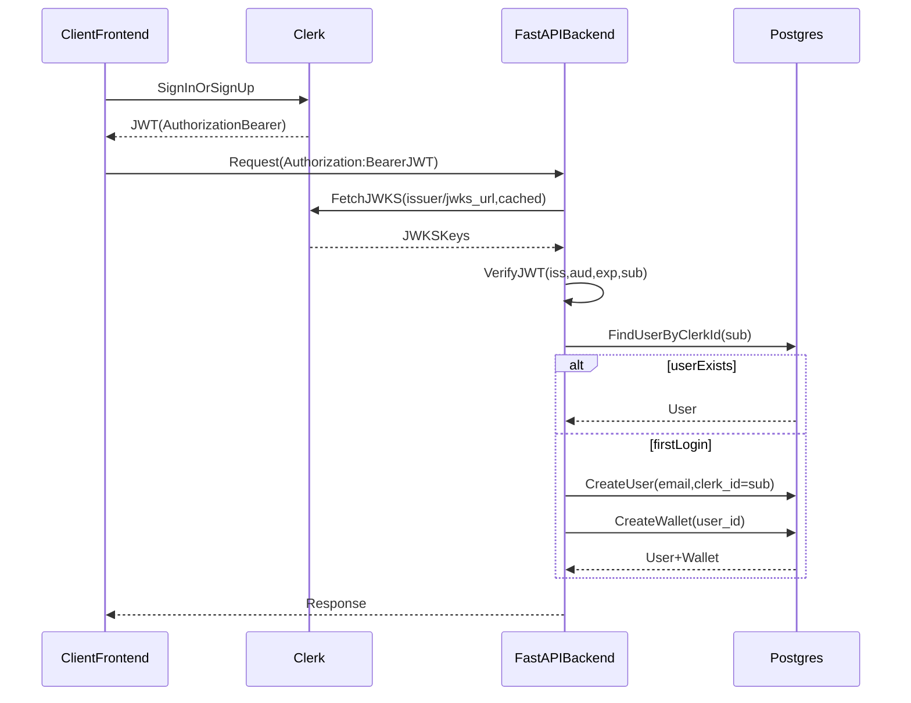

# Proposal: Clipper Gen Platform
**AI-Powered Video Clipping & Viral Content Engine**

## 1. Visi & Objektif
Clipper Gen dirancang sebagai solusi *one-stop* bagi kreator dan agensi untuk melakukan kurasi video durasi panjang (YouTube, Podcast, Webinar) menjadi klip pendek yang viral (TikTok, Reels, Shorts) dengan presisi narasi dan estetika visual yang tinggi.

## 2. Alur Kerja Platform (Workflow)
Workflow kita menggunakan pendekatan **Hybrid AI-Visual Intelligence** untuk memastikan potongan video tidak hanya akurat secara konteks, tapi juga mulus secara transisi visual.

1.  **Ingest & Transcription**:
    *   Pengguna mengunggah file atau menautkan URL video.
    *   Audio diekstraksi dan diproses menggunakan **OpenAI Whisper (faster-whisper)** untuk mendapatkan transkripsi dengan *word-level timestamps*.
2.  **AI Semantic Analysis (Identifying Cut Points)**:
    *   Transkrip dianalisis oleh LLM (GPT-4o/Claude) untuk mendeteksi "Viral Hooks," "Key Takeaways," atau momen emosional/humor.
    *   Output: JSON terstruktur berisi `start_time`, `end_time`, `hook_title`, dan `virality_score`.
3.  **Visual Scene Refinement (Syncing)**:
    *   Menggunakan **PySceneDetect** untuk memvalidasi *cut points* dari LLM agar tepat berada pada potongan frame asli, bukan di tengah-tengah transisi visual yang mengganggu.
4.  **Automated Clipping & Production (FFmpeg)**:
    *   Slicing video dengan `ffmpeg` secara lossless.
    *   **AI Subtitle Generation**: Membuat subtitle yang dinamis (Pop-up/Animated) dengan style "Hormozi" atau minimalis.
    *   **Metadata Generation**: Pembuatan Judul, Tags, dan Deskripsi otomatis untuk SEO sosial media.
5.  **Project Management Interface**:
    *   Semua klip dikumpulkan dalam satu dashboard proyek untuk ditinjau, diedit secara manual jika perlu, dan diekspor.

## 3. Strategi Teknologi (Tech Stack)
*   **Backend Core**: Python (FastAPI) untuk integrasi model AI yang efisien.
*   **Models**: `faster-whisper` (Text), `GPT-4o` (Analysis), `PySceneDetect` (Vision).
*   **Video Processing**: `FFmpeg` & `MoviePy`.
*   **Frontend**: Next.js dengan desain **Material You** & **Minimalism** (Pastel Palette).
*   **Authentication (Users)**: **Clerk-only** (JWT Bearer via JWKS). Backend memetakan identitas ke `users.clerk_id`.
*   **Authentication (Admin/Superadmin)**: **Clerk-only**. Backend menerapkan RBAC melalui `users.role`.

## 3.1 Auth Flow (Clerk-only)

Catatan:
*   Backend tidak menyimpan session; semua request user memakai Bearer JWT dari Clerk.
*   Key rotation ditangani melalui JWKS fetch + cache di backend.
*   Admin/Superadmin memakai Clerk juga; akses dibatasi via RBAC (`users.role`).

## 4. Model Bisnis & Tokenomics
Sesuai arahan, sistem menggunakan paket langganan dan mekanisme token hybrid.

### A. Paket Berlangganan (Subscription)
| Fitur | **Free** | **Basic** | **Premium** |
| :--- | :--- | :--- | :--- |
| **Harga** | Rp 0 | Rp 149rb/bln | Rp 449rb/bln |
| **Kualitas Export** | 720p (Max) | 1080p (Max) | 4K / High Quality |
| **Watermark** | Yes | No | No |
| **Bonus Tokens** | 50 (One-time) | 650 (Bulanan) | 2,500 (Bulanan) |
| **Top-up Access** | No | Yes | Yes (Special Rate) |

### B. Mekanisme Token (Tokenomics)
1.  **Welcome Bonus**: 50 Tokens (One-time) diberikan setelah verifikasi email untuk memacu aktivasi user baru.
2.  **Referral Tokens**: Insentif 25 Tokens bagi Referrer dan 15 Tokens bagi Referee untuk pertumbuhan organik.
3.  **Subscription Bonus**: Diberikan bulanan bagi pengguna Basic/Premium (Hangus setiap 30 hari).
4.  **Top-up Tokens**: Hanya untuk pengguna berbayar, digunakan saat bonus habis (Non-expiry).

### C. Financial & Operations
*   **Budgeting**: Total Anggaran Proyek sebesar **Rp 450.800.000** (Mencakup CAPEX, OPEX 6-bulan, dan 15% Contingency).
*   **Infrastructure**: Fokus pada 1080p standar guna efisiensi bandwidth dan GPU compute time.

## 5. Diferensiasi & Keunggulan
*   **Cost-Efficient AI**: Strategi **Embedding-First** yang memangkas biaya API LLM hingga 80%.
*   **Visual Precision**: Integrasi PySceneDetect mencegah "jarring cuts" pada transisi video.
*   **Scalable Architecture**: Menggunakan FFmpeg-native yang dioptimalkan untuk performa tinggi.

